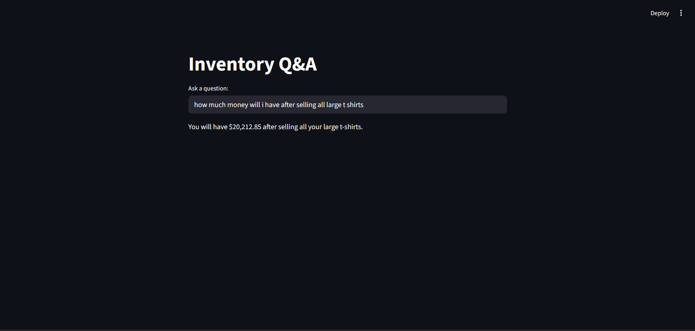

# database-qa

A simple Streamlit app that lets you ask questions to your SQL database and get answers in natural language.  
Powered by Google Gemini for SQL generation.

## Features
- Ask natural language questions about your MySQL database.
- Automatically generates and executes SQL queries.
- Handles revenue calculations (including discounts) automatically.
- Returns clear, human-readable answers (not just raw tables).
- Simple `.env` setup for API keys and secure database connection.

## Files
- **main.py** – The complete Streamlit app (LLM, SQL execution, interface).

## Installation
1. Clone the repo:
   git clone https://github.com/Alii-Jaffal/sql-qa-assistant.git
   cd database-qa

2. Create and activate a virtual environment:
   python -m venv venv
   source venv/bin/activate   # Linux/Mac
   venv\Scripts\activate      # Windows

3. Install dependencies:
   pip install -r requirements.txt

4. Create a `.env` file and add your Google API key:
   GOOGLE_API_KEY=your_api_key_here

5. Make sure your MySQL database (`i used one for t-shirts`) is running and accessible.  
   Update the database credentials inside **main.py** if needed.

## Usage
Run the Streamlit app:
streamlit run main.py

- Enter your question in the input box.
- The app will:
  1. Generate a valid SQL query.
  2. Run it on your MySQL database.
  3. Return a natural language answer.

## Notes
- Works with any MySQL database if you adjust the schema in `SCHEMA`.
- The app cleans LLM output (removes Markdown fences) before execution.
- `.env` is used to keep API keys private (make sure `.env` is in `.gitignore`).
- `__pycache__` is automatically generated by Python and should be ignored.

## Example Questions
- Show me the total revenue after discounts.  
- How many T-shirts are in stock by brand?  
- List all available colors for size L.  
- Which T-shirt has the highest discount?  

## License
This project is open-source and free to use.
